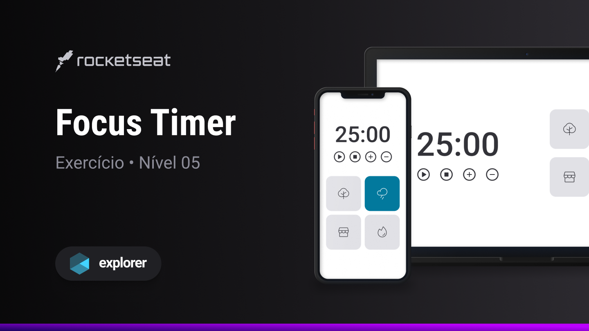

<h1 align="center">Focus Timer 2.0</h1>

Explorer | Stage 05 - Focus Timer

  <a href="#-tecnologias">Tecnologias</a>&nbsp;&nbsp;&nbsp;|&nbsp;&nbsp;&nbsp;
  <a href="#-projeto">Projeto</a>&nbsp;&nbsp;&nbsp;|&nbsp;&nbsp;&nbsp;
  <a href="#-licença">Licença</a>&nbsp;&nbsp;&nbsp;|&nbsp;&nbsp;&nbsp;
  <a href="#autor">Autor</a>

  

 

  

## 🚀 Tecnologias

Esse projeto foi desenvolvido com as seguintes tecnologias:

- HTML
- CSS
- JS

## 💻 Projeto

Este projeto é parte de um dos desafios do curso Explorer da [Rocketseat](https://www.rocketseat.com.br/), onde trabalhamos:

- Funções
- Classes
- Manipulando a DOM
- Ouvindo Eventos da DOM
- Variáveis
- Objetos
- Validação de dados
- ES6 Modules
- Modularização de componentes da aplicação
- Regras básicas de Clean Code
- Reprodução de áudios

## 📝 Licença

Esse projeto está sob a licença MIT.

## Autor

 

Feito com 💜 por Jordane Chaves
